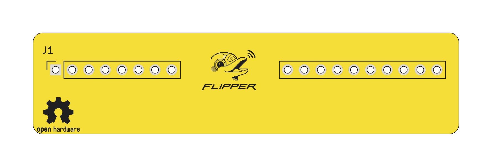
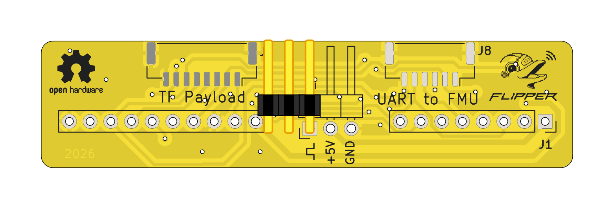

# TFFLIP2PH - Flipper Zero to Pixhawk peripheral adapter

TFFLIP2PH is a compact hardware adapter that allows [Flipper Zero](https://flipper.net) to interface with peripherals using the Pixhawk / Dronecode connector standard. The board exposes common Pixhawk-style peripheral interfaces (UART, I2C, SPI, PWM) and provides regulated 5 V peripheral power, enabling rapid sensor prototyping, testing, and demonstration directly from Flipper Zero. This project is intended as a development and experimental tool, not as a flight controller or flight-qualified hardware.

## Features

* Flipper Zero GPIO to Pixhawk-compatible JST-GH connectors
* Supported interfaces:

  * UART (peripheral devices, telemetry, modems)
  * I2C (sensors)
  * SPI (high-speed sensors)
  * PWM (RC servos, basic actuator testing)
* 5 V peripheral power supply (from Flipper Zero)
* Compact form factor suitable for flat sensors mounting on the back of Flipper Zero
* Designed as a [Small external module](https://docs.flipper.net/zero/development/hardware/modules-blueprints#NIlXe) for Flipper Zero

## Typical use cases

* Rapid prototyping of sensors with Flipper Zero
* Bringing up new hardware using UART / I2C / SPI
* Laboratory testing and output control
* Educational and demonstration purposes
* Basic [servo testing via PWM](https://github.com/ThunderFly-aerospace/flipper-servotester)
* Internal testing and QA tooling

## Construction notes

* Peripheral connectors follow Pixhawk (Dronecode) standard pinouts**
* Peripheral power output: 5 V @ 1A
* Power is sourced from the Flipper Zero switching power supply
* Users are responsible for verifying:

  * Maximal current consumption
  * voltage compatibility
  * signal level requirements of connected devices

⚠️ **Do not connect this board to a powered Pixhawk autopilot or other flight hardware.**

## Mechanical concept

The board is designed to be mounted flat at the top of Flipper Zero, with connectors oriented parallel to the PCB surface.
This allows attached peripherals to be mechanically fixed using tape or hook-and-loop fasteners on the back of the flipper zero for portable experimentation.
